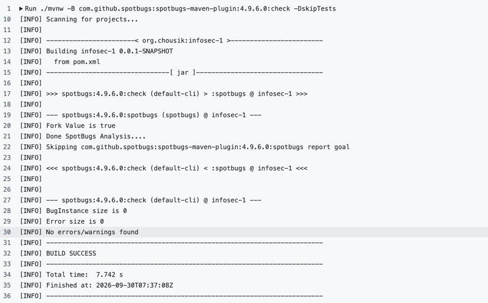
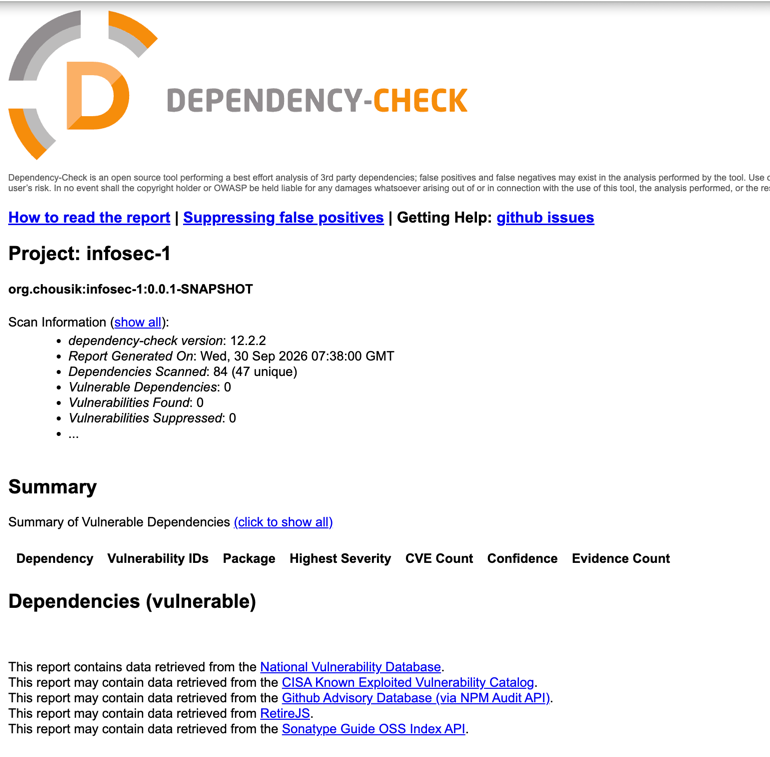

# Информационная безопасность. Лабораторная работа №1

## Описание проекта

Было реализовано REST API-приложение с поддержкой аутентификации на основе JWT-токенов. Неаутентифицированным
пользователям доступен только эндпоинт для входа в систему. После успешной аутентификации пользователь получает доступ к
операциям чтения, добавления и удаления данных.

## Стек

- Java/Spring
- Data JPA/Hibernate
- PostgreSQL
- BCrypt для хранения пароля
- JWT для аутентификации
- SpotBugs и OWASP Dependency-Check

## API

### `POST /auth/login` — аутентификация пользователя

Метод принимает логин и пароль, проверяет учётные данные в базе данных и при успешном входе возвращает JWT-токен. Метод
доступен без токена.

Пример запроса:

```bash
curl -i -X POST http://localhost:8080/auth/login \
  -H 'Content-Type: application/json' \
  -d '{"login":"student","password":"change-this-password"}'
```

Формат ответа:

```json
{
  "token": "eyJhbGciOiJIUzI1NiJ9..."
}
```

При неверном логине или пароле возвращается `401 Unauthorized`.

### `GET /api/data` — получение данных

Метод возвращает список всех записей из базы данных. Доступ разрешён только аутентифицированному пользователю.

Пример запроса:

```bash
curl -i http://localhost:8080/api/data \
  -H 'Authorization: Bearer <JWT>'
```

Формат ответа:

```json
[
  {
    "id": 1,
    "content": "First record"
  },
  {
    "id": 2,
    "content": "Second record"
  }
]
```

Запрос без токена или с повреждённым токеном возвращает `401 Unauthorized`.

### `POST /api/data` — добавление данных

Метод добавляет новую запись в базу данных и возвращает созданный объект. Доступ разрешён только аутентифицированному
пользователю.

Пример запроса:

```bash
curl -i -X POST http://localhost:8080/api/data \
  -H 'Authorization: Bearer <JWT>' \
  -H 'Content-Type: application/json' \
  -d '{"content":"Новая запись"}'
```

Формат ответа:

```json
{
  "id": 3,
  "content": "Новая запись"
}
```

При успешном добавлении возвращается статус `201 Created`.

### `DELETE /api/data/{id}` — удаление данных

Метод удаляет запись с указанным идентификатором. Доступ разрешён только аутентифицированному пользователю.

Пример запроса:

```bash
curl -i -X DELETE http://localhost:8080/api/data/3 \
  -H 'Authorization: Bearer <JWT>'
```

Формат ответа:

```http
HTTP/1.1 204 No Content
```

Тело успешного ответа отсутствует. Если запись с указанным идентификатором не найдена, возвращается `404 Not Found`.

## Реализованные меры защиты

### Защита от SQL-инъекций

Доступ к данным реализован через Spring Data JPA. В приложении не формируются SQL-запросы путём конкатенации
пользовательского ввода. Операции поиска, сохранения и удаления выполняются через методы `JpaRepository`, что исключает
классический SQL Injection через подстановку пользовательских данных в SQL-строку.

### Защита от XSS

Перед отправкой клиенту содержимое каждой записи экранируется с помощью `HtmlUtils.htmlEscape`. Поэтому введённая
пользователем строка с HTML/JavaScript-кодом возвращается как экранированный текст, а не как исходная HTML-разметка.

### Защита аутентификации

- исходный пароль сохраняется в PostgreSQL только в виде BCrypt-хэша;
- после успешного входа создаётся подписанный JWT с ограниченным сроком жизни;
- JWT-секрет передаётся через `JWT_SECRET` и не хранится в Git;
- `JwtAuthenticationFilter` защищает все маршруты кроме `auth`. При отсутствующем, неверном или просроченном токене
  возвращается `401`;
- при несуществующем логине и неверном пароле возвращается одинаковая ошибка, поэтому по тексту ответа нельзя
  определить, существует ли пользователь с указанным логином.

## Скриншоты отчётов

### SpotBugs



### OWASP Dependency-Check


